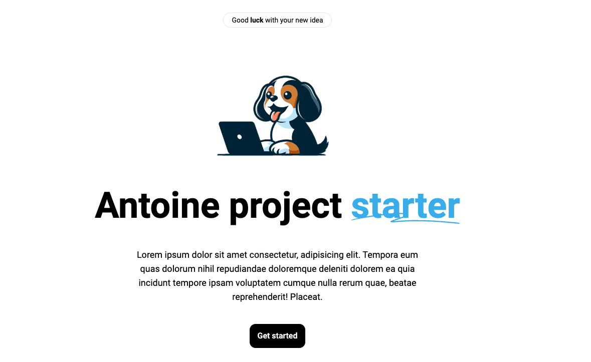

# Nuxt starter 



## Project Setup 


### Firebase : 

### Create a new web app in Firebase

Firebase will give an object ocntaining the credential for the project : 

Use the firebase config in ```nuxt.config.js```
```js
const firebaseConfig = {
    apiKey: "qsdqsdqdsqsdqds",
    authDomain: "ab-app-2dds94.firebaseapp.com",
    projectId: "ab-app-2b4",
    storageBucket: "ab-ab94.appspot.com",
    messagingSenderId: "207230362199",
    appId: "1:20723wcw2199:web:e4f4912"
}
```

### Use the Firebase Auth 

Just go to ``` https://console.firebase.google.com/project/<projectId>/authentication/users ``` and enable auth

Login and set the first data in the firebase store it will create a collection named ```Users```

### Set rules on Firestore : 

```JavaScript
rules_version = '2';

service cloud.firestore {
  match /databases/{database}/documents {

     match /users/{userId} {
      allow read: if request.auth.uid == userId;
      
      // Define rules for individual documents within the user's data.
      match /{document=**} {
        allow write: if request.auth.uid == userId;
      }
    }
    
  }
}
```
With those rules : users can only modify their own data within this collection.


```

## Build Setup


```bash
# install dependencies
$ npm install

# serve with hot reload at localhost:3000
$ npm run dev

# build for production and launch server
$ npm run build
$ npm run start

# generate static project
$ npm run generate
```

For detailed explanation on how things work, check out the [documentation](https://nuxtjs.org).

## Special Directories

You can create the following extra directories, some of which have special behaviors. Only `pages` is required; you can delete them if you don't want to use their functionality.

### `assets`

The assets directory contains your uncompiled assets such as Stylus or Sass files, images, or fonts.

More information about the usage of this directory in [the documentation](https://nuxtjs.org/docs/2.x/directory-structure/assets).

### `components`

The components directory contains your Vue.js components. Components make up the different parts of your page and can be reused and imported into your pages, layouts and even other components.

More information about the usage of this directory in [the documentation](https://nuxtjs.org/docs/2.x/directory-structure/components).

### `layouts`

Layouts are a great help when you want to change the look and feel of your Nuxt app, whether you want to include a sidebar or have distinct layouts for mobile and desktop.

More information about the usage of this directory in [the documentation](https://nuxtjs.org/docs/2.x/directory-structure/layouts).


### `pages`

This directory contains your application views and routes. Nuxt will read all the `*.vue` files inside this directory and setup Vue Router automatically.

More information about the usage of this directory in [the documentation](https://nuxtjs.org/docs/2.x/get-started/routing).

### `plugins`

The plugins directory contains JavaScript plugins that you want to run before instantiating the root Vue.js Application. This is the place to add Vue plugins and to inject functions or constants. Every time you need to use `Vue.use()`, you should create a file in `plugins/` and add its path to plugins in `nuxt.config.js`.

More information about the usage of this directory in [the documentation](https://nuxtjs.org/docs/2.x/directory-structure/plugins).

### `static`

This directory contains your static files. Each file inside this directory is mapped to `/`.

Example: `/static/robots.txt` is mapped as `/robots.txt`.

More information about the usage of this directory in [the documentation](https://nuxtjs.org/docs/2.x/directory-structure/static).

### `store`

This directory contains your Vuex store files. Creating a file in this directory automatically activates Vuex.

More information about the usage of this directory in [the documentation](https://nuxtjs.org/docs/2.x/directory-structure/store).


## About routing / avoid 404 reload 

https://stackoverflow.com/questions/56673290/nuxt-application-returns-404-when-dynamic-routes-are-refreshed-tomcat-server


### IA Image prompt

```
Créer moi un logo qui doit être de type vector flat minimaliste. Il doit être en couleur. L'une des couleurs dominante doit être le orange #ff7a59. Il doit représenter un personnage (un panda roux) extrêmement triste et décu qui utilise un ordinateur portable. Le fond de l'image doit être transparent. Son visage doit être assez rond et le haut se ses oreilles doit être arrondi
```